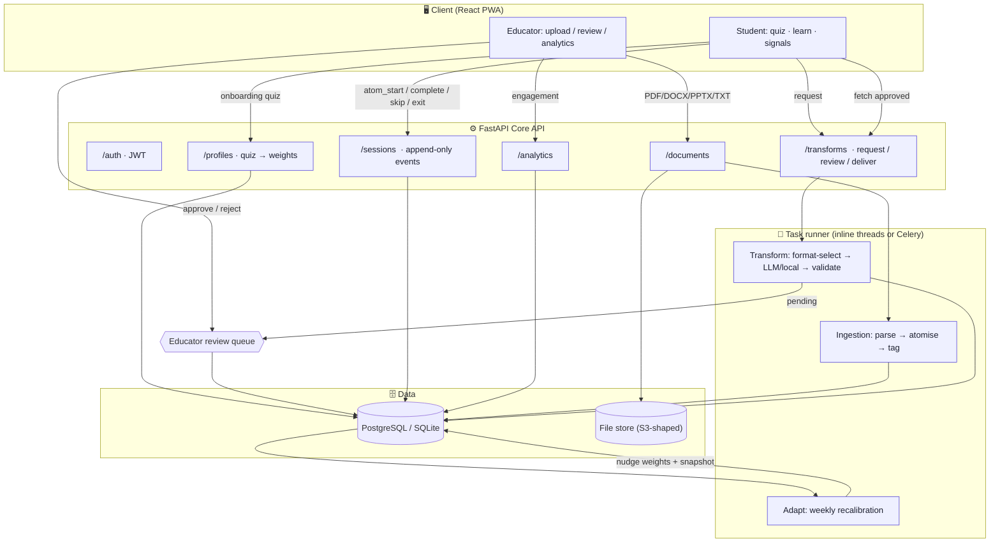
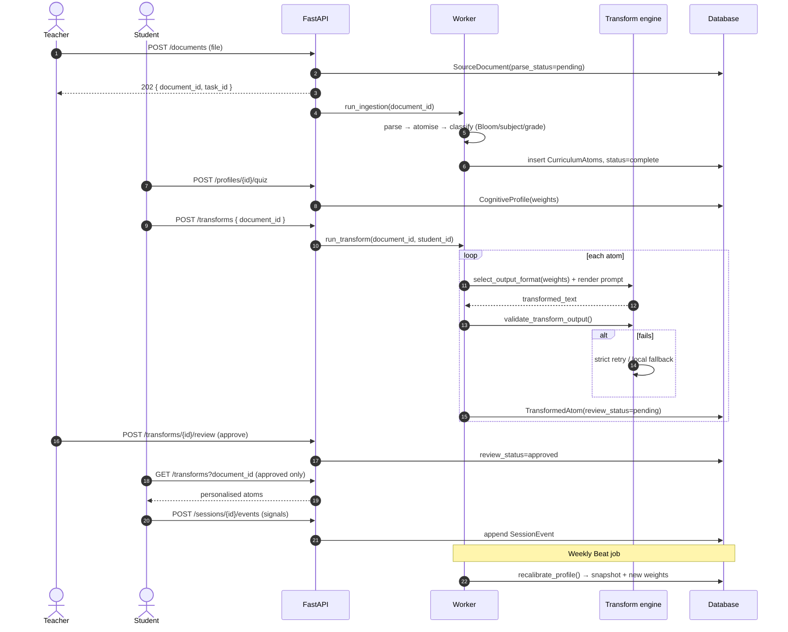
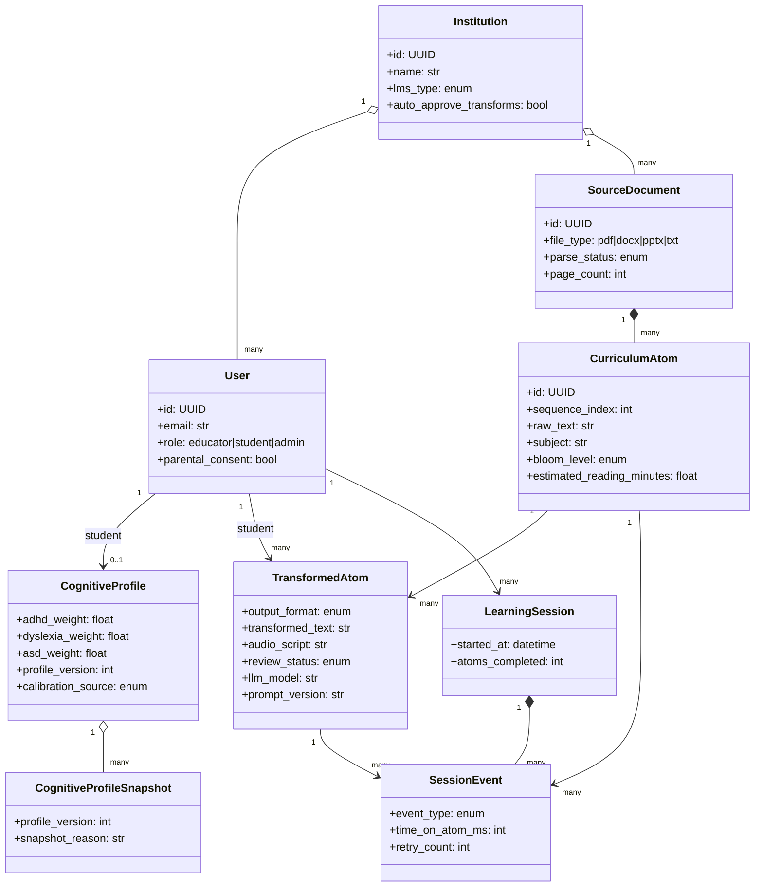
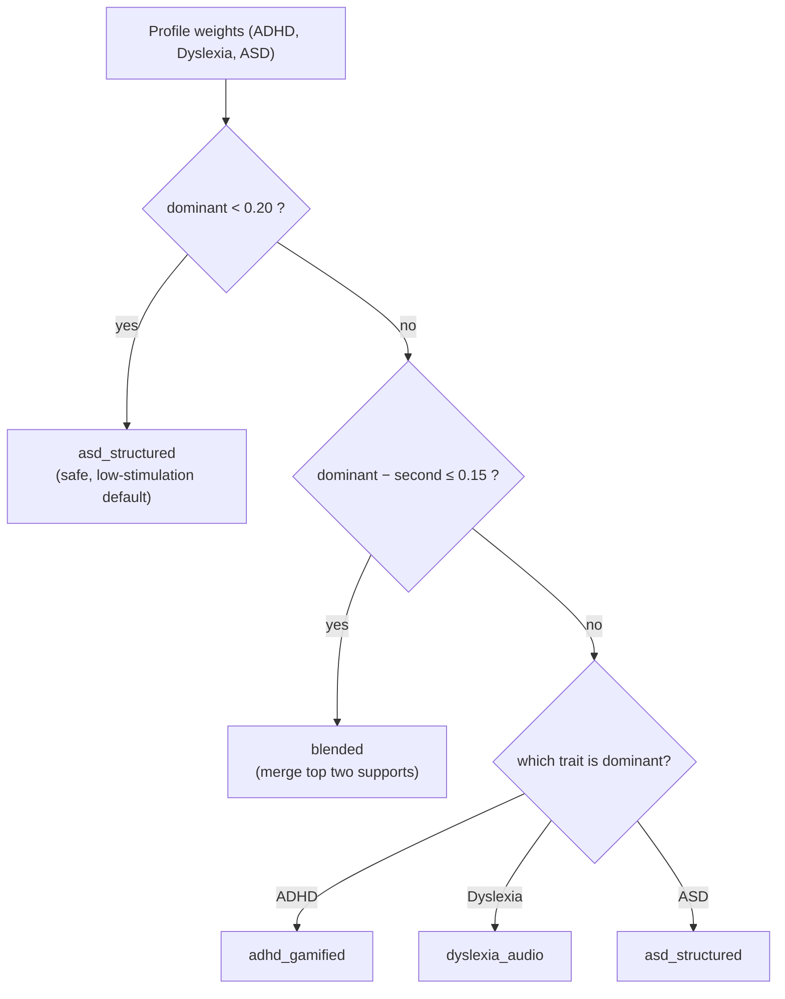
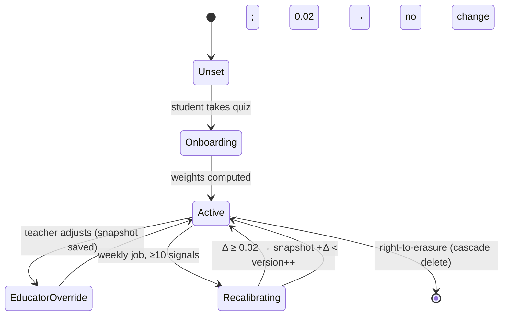
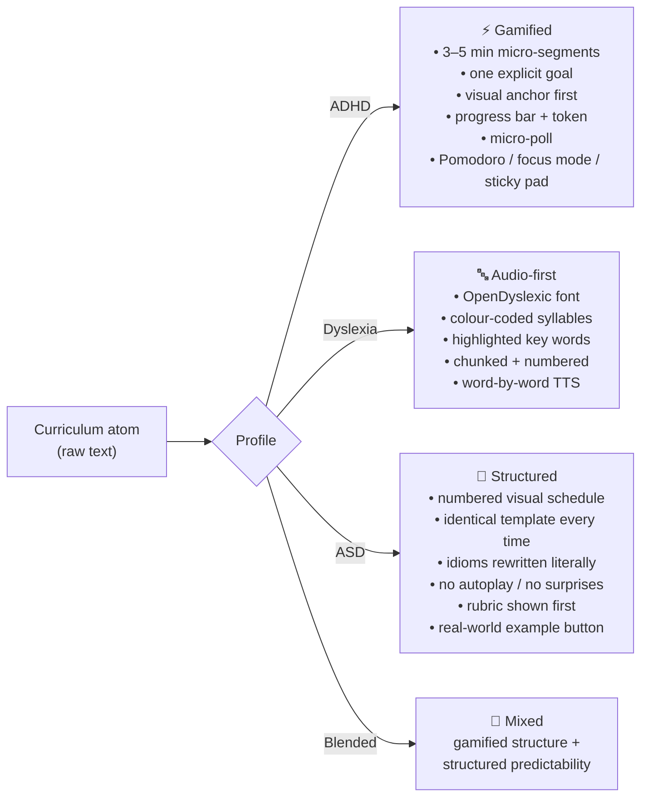

# NeuraCore — Architecture & UML

> All diagrams are [Mermaid](https://mermaid.js.org). They render automatically
> on GitHub, in VS Code (Markdown Preview Mermaid extension), or at
> <https://mermaid.live>.

---

## 1 · System flow — *the pipeline that speaks for itself*

---

## 2 · Sequence (UML) — upload → adaptive delivery

---

## 3 · Domain model (UML class diagram)

---

## 4 · Format selection (decision logic)

---

## 5 · Profile lifecycle (UML state diagram)

---

## 6 · Accessibility transform matrix (what each profile receives)

